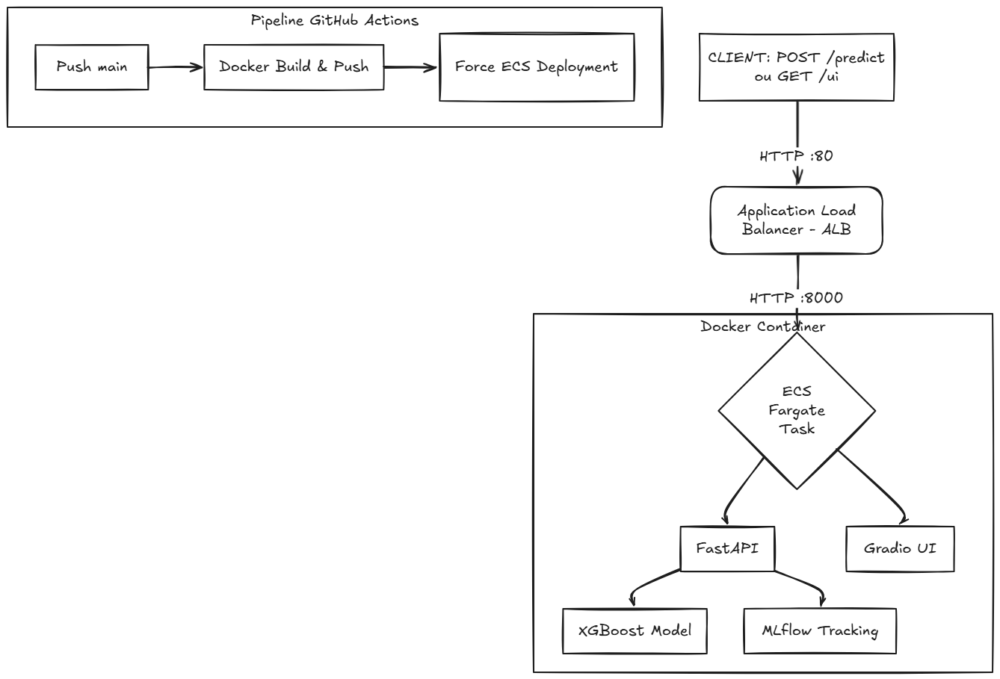

# 📉 Churn des Clients Télécom — Projet ML de bout en bout


Construisez, suivez, servez et déployez un modèle de prédiction de désabonnement (churn) de niveau production — d'un fichier CSV à une API REST en direct sur AWS.

## Table des Matières

- [Aperçu](#aperçu)
- [Architecture](#architecture)
- [Jeu de données](#jeu-de-données)
- [Structure du Projet](#structure-du-projet)
- [Méthodologie](#méthodologie)
- [Modèle & Résultats](#modèle--résultats)
- [Référence API](#référence-api)
- [Installation & Développement Local](#installation--développement-local)
- [Déploiement](#déploiement)
- [Pipeline CI/CD](#pipeline-cicd)
- [Dépannage](#dépannage)

## Aperçu

Ce projet livre un pipeline MLOps complet pour prédire le départ des clients dans un contexte de télécommunications. Le modèle XGBoost entraîné est servi via un point de terminaison REST FastAPI et une interface web Gradio, conteneurisé avec Docker, suivi avec MLflow, et déployé sur AWS ECS Fargate derrière un Application Load Balancer avec un flux de travail CI/CD GitHub Actions.

### Quel problème cela résout-il ?

| Sans ce système | Avec ce système |
| :--- | :--- |
| Churn détecté après la résiliation | Clients à risque identifiés proactivement |
| Modèle enfoui dans un notebook | N'importe qui peut requêter `/predict` depuis n'importe quel système |
| "Ça marche sur ma machine" | Builds reproductibles via Docker + CI/CD |
| Pas d'historique d'expériences | Chaque exécution est logguée dans MLflow avec métriques & artefacts |

## Architecture



### Stack

| Couche | Technologie |
| :--- | :--- |
| Modèle | XGBoost Classifier |
| Suivi d'expériences | MLflow |
| API d'Inférence | FastAPI + Uvicorn |
| Interface Web | Gradio (monté sur `/ui`) |
| Conteneurisation | Docker |
| Registre | Docker Hub |
| Orchestration | AWS ECS Fargate (serverless) |
| Équilibrage de charge | AWS ALB (HTTP :80 → :8000) |
| Observabilité | AWS CloudWatch Logs |
| CI/CD | GitHub Actions |

## Jeu de données

| Propriété | Détails |
| :--- | :--- |
| Source | Telco Customer Churn — Kaggle |
| Observations | 7 043 clients |
| Caractéristiques | 20 (démographie, services, contrat, facturation) |
| Cible | Churn — Oui (1) / Non (0) |
| Distribution des classes | ~73% Non · ~27% Oui |

**Groupes de caractéristiques :**

- **Démographie :** genre, SeniorCitizen, Partenaire, Dépendants
- **Services :** PhoneService, MultipleLines, InternetService, OnlineSecurity, TechSupport, StreamingTV, StreamingMovies
- **Contrat & Facturation :** Contract, PaperlessBilling, PaymentMethod, MonthlyCharges, TotalCharges
- **Ancienneté :** tenure (mois passés dans l'entreprise)

## Structure du Projet

```text
Churn_Machinelearning_Model/
│
├── data/
│   └── WA_Fn-UseC_-Telco-Customer-Churn.csv   # Jeu de données brut
│
├── notebooks/
│   └── churn_eda_modeling.ipynb               # Exploration & prototypage
│
├── src/
│   ├── app/
│   │   ├── main.py                            # Point d'entrée FastAPI
│   │   ├── predict.py                         # Logique d'inférence
│   │   └── gradio_ui.py                       # UI Gradio montée sur /ui
│   ├── train.py                               # Script d'entraînement (logs vers MLflow)
│   └── preprocess.py                          # Pipeline d'ingénierie des caractéristiques
│
├── mlruns/                                      # Suivi local MLflow (git-ignored)
├── models/
│   └── model.pkl                                # Modèle sérialisé (fallback local)
│
├── Dockerfile
├── requirements.txt
├── .github/
│   └── workflows/
│       └── deploy.yml                           # CI/CD GitHub Actions
└── README.md
```

## Méthodologie

### 1. Analyse Exploratoire des Données (EDA)

- Taux de désabonnement par type de contrat, mode de paiement et cohortes d'ancienneté.

- Distribution de `MonthlyCharges` et `TotalCharges` entre les clients partis et restants.
- Identification des valeurs nulles pour `TotalCharges` (clients avec une ancienneté == 0).

### 2. Pipeline de Prétraitement

1. `TotalCharges` → conversion en float, remplissage des nuls par la médiane.
2. Encodage binaire : colonnes Oui/Non → 1/0.
3. One-hot encoding : Contract, PaymentMethod, InternetService, etc.
4. StandardScaler sur : tenure, MonthlyCharges, TotalCharges.
5. Découpage Train/Test : 80/20, stratifié sur le Churn.

### 3. Ingénierie des Caractéristiques

- `charges_per_month_ratio` = TotalCharges / (tenure + 1) — indicateur de la trajectoire des coûts.

- Type de contrat encodé de manière ordinale : Mensuel (0) < Un an (1) < Deux ans (2).

### 4. Modèle : XGBoost Classifier

Sélectionné pour :

- Meilleur AUC-ROC en validation croisée parmi les modèles testés.
- Gestion native du déséquilibre des classes via `scale_pos_weight`.
- Inférence rapide adaptée aux appels API en temps réel.

Réglage des hyperparamètres via `RandomizedSearchCV` (5-fold, stratifié) :

```python
param_grid = {
    "n_estimators": [100, 200, 300],
    "max_depth": [3, 5, 7],
    "learning_rate": [0.01, 0.05, 0.1],
    "subsample": [0.7, 0.8, 1.0],
    "scale_pos_weight": [2.5, 3.0],
}
```

### 5. Suivi d'Expériences avec MLflow

Chaque exécution d'entraînement enregistre :

- Paramètres (n_estimators, max_depth, learning_rate, ...)
- Métriques (AUC-ROC, F1, Rappel, Précision)
- Artefact du modèle (sérialisé en .pkl)
`mlflow ui` # Pour voir les exécutions sur <http://localhost:5000>

## Modèle & Résultats

Résultats sur le jeu de test retenu (20%).

| Métrique | Valeur |
| :--- | :--- |
| AUC-ROC | ~0.87 |
| Rappel (Churn = 1) | ~0.80 |
| Précision (Churn = 1) | ~0.66 |
| F1-Score (Churn = 1) | ~0.72 |
| Précision Globale (Accuracy) | ~0.81 |

**Cible d'optimisation principale :** Rappel (Recall) sur la classe churn. Manquer un vrai client sur le départ coûte plus cher qu'une fausse alerte.

**Principales caractéristiques prédictives :**

- **Type de contrat** — les clients en contrat mensuel partent ~3× plus que les abonnés annuels.
- **Ancienneté (tenure)** — les 12 premiers mois sont la fenêtre à plus haut risque.
- **MonthlyCharges** — des frais élevés combinés à une faible ancienneté signalent un risque élevé.
- **Support Technique / Sécurité en ligne** — l'absence de ces services est fortement corrélée au churn.
- **Mode de paiement** — les utilisateurs de chèques électroniques ont le taux de churn le plus élevé.

## Référence API

### `GET /`

Vérification de l'état (Health check).

```json
{ "status": "ok" }
```

### `POST /predict`

Prédit la probabilité de désabonnement pour un client.
**Corps de la requête :**

```json
{
  "tenure": 12,
  "MonthlyCharges": 70.5,
  "TotalCharges": 846.0,
  "Contract": "Month-to-month",
  "PaymentMethod": "Electronic check",
  "InternetService": "Fiber optic",
  "OnlineSecurity": "No",
  "TechSupport": "No",
  "SeniorCitizen": 0,
  "Partner": "Yes",
  "Dependents": "No",
  "PaperlessBilling": "Yes"
}
```

**Réponse :**

```json
{
  "churn_probability": 0.73,
  "churn_prediction": 1,
  "risk_level": "High"
}
```

### `GET /ui`

Ouvre l'interface web Gradio pour des tests manuels interactifs — sans code requis.

## Installation & Développement Local

### Prérequis

- Python 3.10+

- Docker (pour le mode conteneur)
- AWS CLI (pour le déploiement)

### 1. Cloner & installer

```bash
git clone [https://github.com/Takou07/Churn_Machinelearning_Model.git](https://github.com/Takou07/Churn_Machinelearning_Model.git)
cd Churn_Machinelearning_Model

python -m venv venv
source venv/bin/activate        # Windows: venv\Scripts\activate

pip install -r requirements.txt
```

### 2. Entraîner le modèle

```bash
python src/train.py
# Enregistre l'exécution dans MLflow ; sauvegarde le modèle dans models/model.pkl
```

### 3. Lancer l'API localement

```bash
export PYTHONPATH=$(pwd)/src     # Windows: set PYTHONPATH=%cd%\src
uvicorn src.app.main:app --host 0.0.0.0 --port 8000 --reload
```

- Swagger UI: <http://localhost:8000/docs>

- Gradio UI: <http://localhost:8000/ui>
- MLflow UI: `mlflow ui` → <http://localhost:5000>

### 4. Lancer avec Docker

```bash
# Build
docker build -t churn-api .

# Run
docker run -p 8000:8000 churn-api

# Test rapide
curl -X POST http://localhost:8000/predict \
  -H "Content-Type: application/json" \
  -d '{"tenure": 5, "MonthlyCharges": 80, "TotalCharges": 400, ...}'
```

## Déploiement

L'application s'exécute sur AWS ECS Fargate derrière un Application Load Balancer.

### Aperçu de l'infrastructure

Internet
  │ :80
ALB  (SG: autoriser TCP 80 entrant depuis 0.0.0.0/0)
  │ :8000
ECS Fargate Task  (SG: autoriser TCP 8000 entrant depuis l'ALB uniquement)
  │
  ├── FastAPI (uvicorn, src.app.main:app)
  └── Gradio UI (/ui)

Logs → CloudWatch Log Group: `/ecs/churn-api`

### Déploiement manuel

```bash
# 1. Build & push de l'image
docker build -t votredockerhub/churn-api:latest .
docker push votredockerhub/churn-api:latest

# 2. Forcer un nouveau déploiement ECS
aws ecs update-service \
  --cluster churn-cluster \
  --service churn-service \
  --force-new-deployment
```

### Variables d'environnement (Définition de tâche ECS)

| Variable | Description |
| :--- | :--- |
| `PYTHONPATH` | `/app/src` |
| `MLFLOW_EXPERIMENT_NAME` | Nom de l'expérience MLflow à charger |
| `MODEL_PATH` | Chemin vers le modèle sérialisé à l'intérieur du conteneur |

## Pipeline CI/CD

`.github/workflows/deploy.yml` se déclenche à chaque push sur `main` :

1. Push sur `main`
2. Checkout du code
3. Connexion à Docker Hub
4. Build de l'image Docker
5. Push de l'image sur Docker Hub
6. Forcer un nouveau déploiement ECS (étape optionnelle)

### Secrets GitHub requis

| Secret | Description |
| :--- | :--- |
| `DOCKER_USERNAME` | Nom d'utilisateur Docker Hub |
| `DOCKER_PASSWORD` | Jeton d'accès Docker Hub |
| `AWS_ACCESS_KEY_ID` | Clé IAM (permissions ECS) |
| `AWS_SECRET_ACCESS_KEY` | Secret IAM |
| `AWS_REGION` | ex: eu-west-3 |

## Dépannage

Journal des problèmes réels rencontrés lors du développement et du déploiement.

- **Cibles ALB affichées comme "Unhealthy"**
  - **Cause :** L'application ne répondait pas sur le chemin du health-check ; décalage de port listener/cible.
  - **Solution :** Ajout de `GET /` renvoyant `{"status": "ok"}`. Configuration du Listener ALB sur :80 redirigeant vers le Target Group sur :8000 (chemin `/`).
- **ModuleNotFoundError: No module named 'serving' dans le conteneur**
  - **Cause :** Le chemin Python dans le conteneur n'incluait pas `src/`.
  - **Solution (Dockerfile) :** `ENV PYTHONPATH=/app/src`
- **DNS de l'ALB en timeout**
  - **Cause :** Règles des Groupes de Sécurité (SG) mal alignées.
  - **Solution :** ALB SG : entrant TCP 80 depuis 0.0.0.0/0. Task SG : entrant TCP 8000 depuis l'ID du SG de l'ALB (pas un CIDR).
- **ECS ne prend pas la nouvelle image Docker**
  - **Cause :** Le service utilise toujours une ancienne définition de tâche en cache.
  - **Solution :** `aws ecs update-service --cluster <cluster> --service <service> --force-new-deployment`
